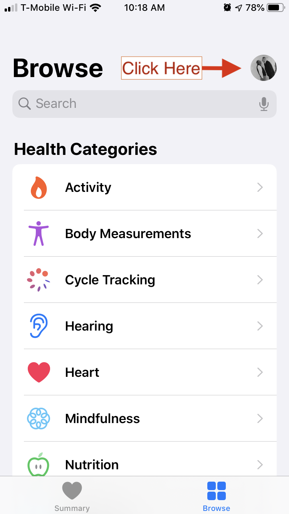

```{r setup, include=FALSE}
knitr::opts_chunk$set(echo = TRUE)
```

This will be the first of a series of posts
on the Apple Health Export. Today's post will work through the mechanics of moving data from the Apple Health app
out of your iPhone and into R where you can analyze it. 
It will describe in detail the problem of 
adjusting the time stamps for daylight savings time and travel across time zones.
It gets flight information
from TripIt and uses that information to track movements across time zones that
affect Apple Health Export time stamps.

##### First, export the data from the Health app

From the Health app on your iPhone, one can export all of the data you are able to view via the Health app. 
Open the Health app on your iPhone. 
To export, you need to first go to your personal settings by
clicking on your icon near the upper right corner of the Browse screen. 
(See the the first screenshot below.)
Click on the icon and you will see some of your personal settings. 
You will need to scroll to the bottom of this page, where you will
see a clickable line "Export All Health Data", as shown in the second screenshot below. 

<style> 
.row {
  display: flex;
}
.column {
  flex: 100%;
  padding: 5px;
}
</style>
<div class="row">
  <div class="column">
    <figure>
      <figcaption> Browse Health app</figcaption>
      
    </figure>
  </div>
  <div class="column">
    <figure>
      <figcaption>Export All Health Data</figcaption>
      
    </figure>
  </div>
</div>
Once you click OK to go ahead with the export, it may take a significant amount of time.
On my iPhone 8 it takes more than five minutes. Once it is complete, you'll get a 
dialog that asks where to send the exported data. I use AirDrop to send it to the
Mac where I am running RStudio. It ends up in the Downloads folder on that Mac.
If you need to move the data to a Windows computer, you may need to send it
via email or Dropbox.
The exported file is named `export.zip`. If you double-click on that file it 
will expand into a folder called `apple_health_export`. The uncompressed file is huge
in comparison with the size of the zip file. In my case, `export.zip` is about
79 megabytes which becomes an `apple_health_export` folder that is 2.45 gigabytes!
In my R code, I uncompress the file into my Downloads folder, which is excluded
from my Time Machine backups.

##### R code to expand the export file and import it as XML data

The R code below shows how to decompress `export.zip` and follow some
basic steps to import it into R. I'm following in the footsteps of
several people who have published code to accomplish these steps.
See  work by [Ryan Praskievicz](https://gist.github.com/ryanpraski/ba9baee2583cfb1af88ca4ec62311a3d), [Taras Kaduk](https://taraskaduk.com/2019/03/23/apple-health/), [Raul Eulogio](https://www.inertia7.com/projects/149), and [Deepankar Datta](https://github.com/deepankardatta/AppleHealthAnalysis) (who has
created a package called AppleHealthAnalysis). I'm sure there are other examples
using R, and there are quite a number of examples using python (e.g., by [Mark Koester](http://www.markwk.com/data-analysis-for-apple-health.html)).

The R code uncompresses the zip file and replaces the `apple_health_export` folder.
(Because of the size of this folder, I try to avoid having multiple copies and also
avoid having it saved to my disk backup.)
The big file inside that folder is `export.xml`. Following the examples sited above, I
use the XML package to convert the major elements of the XML file into
tidy data frames.

```{r load_libraries, messages = FALSE, warnings = FALSE}
library(tidyverse, quietly = TRUE)
#library(jsonlite, quietly = TRUE)
library(lubridate, quietly = TRUE)
library(XML, quietly = TRUE)
library(knitr)
library(kableExtra) 
library(PerformanceAnalytics) # to get correlation matrix
library(janitor) # so that I an use the tabyl function
library(scales) # to help format some tabular data
library(fuzzyjoin)
```
```{r import_xml, echo = TRUE, cache = TRUE, messages = FALSE}
rc <- unzip("~/Downloads/export.zip", exdir = "~/Downloads", overwrite = TRUE)
if (length(rc) != 0) {
  file.remove("~/Downloads/export.zip")
  # once unzipped, delete export.zip. Otherwise, the next time Air Drop sends export.zip
  # to your mac it will be renamed as export2.zip and you may accidentally process
  # an out-of-date set of data.
  
  # takes a bit more than 20 seconds on my iMac
  health_xml <- xmlParse("~/Downloads/apple_health_export/export.xml")
  # takes about 70 seconds on my iMac
  health_df <- XML:::xmlAttrsToDataFrame(health_xml["//Record"], stringsAsFactors = FALSE) %>%
    as_tibble() %>% mutate(value = as.numeric(value))
  
  activity_df <- XML:::xmlAttrsToDataFrame(health_xml["//ActivitySummary"], stringsAsFactors = FALSE) %>% 
    as_tibble()
  workout_df <-  XML:::xmlAttrsToDataFrame(health_xml["//Workout"], stringsAsFactors = FALSE) %>% 
    as_tibble
  clinical_df <- XML:::xmlAttrsToDataFrame(health_xml["//ClinicalRecord"]) %>% 
    as_tibble()
} else print(load("interim_save.RData"))
```

I won't go into the details of the XML structure of the health export.
For most purposes, the Record, ActivitySummary, Workout, and Clinical data types
will provide all that you are looking for. My expanded Apple Health Export
folder also includes workout GPX files, electrocardiograms, and clinical
records imported from my health system's medical records.

I have a bit over two years of Apple Watch data in my iPhone. 
After a full career working
as a data analyst, this is the largest number of data points
I have ever dealt with. Extracting the "Record" data  from `export.xml` produces
3.4 million rows and takes about 70 seconds on my 2019 iMac. 

The counts by "type" describe the breadth and quantity of data:
```{r freq_type, echo = FALSE}
health_df2 <- health_df %>% 
  mutate(source = case_when(
    str_detect(sourceName, "Phone") ~ "Phone",
    str_detect(sourceName, "Watch") ~ "Watch",
    str_detect(sourceName, "Lose It") ~ "Lose It!",
    TRUE ~ "Other"),
    source = factor(source, levels = c("Watch", "Phone", "Lose It!", "Other")))
health_df2 %>% 
  janitor::tabyl(type, source) %>% 
  janitor::adorn_totals("col") %>%  arrange(desc(Total)) %>% 
  janitor::adorn_totals("row") %>% # do column total after arrange
  kable(format.args = list(decimal.mark = " ", big.mark = ","),
        caption = "Frequency by Type and Data Source", format = "markdown") %>% 
  clipr::write_clip(allow_non_interactive = TRUE) %>% print()

```

In terms of number of observations, most of the data is collected via my Apple Watch rather than my iPhone. 
The Health App serves as a central repository for data from non-Apple sources as well as
the data collected by watch and phone.
I have been using the *Lose It!* app on my iPhone for about six months to count calories,
and that produces a noticeable amount of data. 
The free version of the app which I am using does not display much beyond
basic calorie counts. 
It's interesting to see that the more detailed nutrition breakdowns are passed
into the Health app. 

I'm using an Omron blood pressure cuff 
that can transfer readings to the Omron app on the iPhone via Bluetooth. Those
readings are then updated in the Apple Health database. 
There also are a few odds and ends contributed by apps on my iPhone
such as AllTrails, Breathe, and AutoSleep.

Sometimes the same data may be repeated on multiple sources
so it is important to pay attention to `sourceName`.
Note that step counts, flights climbed, and distance walking/running
come from both the Watch and the iPhone. 
On any particular day you probably want to include only one of the sources.
Otherwise you risk double counting. 
Generally I am focused on the Watch data, but I have almost three years of
data from my iPhone before I started wearing the Apple Watch.

The other major XML categories are ActivitySummary, Workout, and ClinicalRecord. 
For ActivitySummary I have one row per
day which basically summarizes some of the intra-day activity data. 
Workout has one row per workout. If I were
still running I would focus much more on that data frame. 
For each workout it shows type, distance, duration, 
and energy burned Most of my workouts are outdoor walks. 
Quite often I forget to end the workout when I end the walk,
which certainly reduces the usefulness of the data. 
But I would imagine that for a runner or a swimmer or a cyclist, 
the Workout information would be interesting and useful.

ClinicalRecord is a bit tricky. 
I have set things up so that my health organization shares my health records with the
Apple Health app.

```{r count_clin_record_types}
clinical_df %>% count(type) %>% kable(format = "markdown", caption = "Types of Clinical Items")
```

In the clinical data frame there is a column called `resourceFilePath` that contains 
the path to a json dataset in the `Apple Health Export/clinical records` folder. Presumably
this would allow you to retrieve items such as individual lab test results. 
I haven't made any attempt to get into this data. I only know what's available
here because I can view it via the Apple Health app.

### The Problem of Time Zones and Daylight Savings

When I first looked at day by day data for resting heart rate I bumped into
problems cause by the issue of time zones. I have about 745 rows of data of type
`HKQuantityTypeIdentifierRestingHeartRate` which should be one per day. 
I quickly discovered I had several days where there were two values in a single day, 
and that was related to
occasions when I traveled by air to a different time zone.

This leads to a long digression on the subject of computer time stamps and time zones. 
(There is an [entertaining video](https://www.youtube.com/watch?v=-5wpm-gesOY) that describes
the general problem of time stamps and time zones, but it doesn't relate to the specific
problems that I will get into here. It's fun if you want to nerd out on this topic.)

Before I dive into the issue of time stamps, note that for many purposes you can just 
ignore this issue and skip the headaches associated with adjusting the time stamps.
For my purposes I care about time of day so it was worthwhile to try to get the time of day correct.

Each item in the records of the health dataset has a creation, start, and end time stamp. In the export dataset
they appear as a character string that looks like this: "2019-04-10 07:10:34 -0400". 
The "-0400" on the end
is because when I began this text the local time was Eastern Daylight Savings which is four hours 
earlier than UTC (universal
time code). At first I thought that time code info would take care of everything. 
In fact, it is useless.
As near as I can tell, the internal data has no indication of time zone. [^1]
The UTC offset is attached to the datetime information when the data is exported. 
Ever single time stamp in the exported dataset has the same "-0400" offset,
which merely represent my local offset at the time the export was done. 
If I re-exported that data after the
switch to Eastern Standard Time, all of the offsets will appear as "-0500". 
In fact, the exported data has no information about time zone. 
When I did a workout in San Diego in January, the time stamp that was attached to that workout
was the local time when I did the workout. In the export file now it has a UTC offset of "-0400"
(or "-0500" depending on daylight savings). 
In reality, local time when I did the workout was offset from UTC by "-0800" (i.e.. 8 hours). 
I can tell that this is an issue of how the Apple Health data stores 
the date and time because I can see the issue via the Activity app on my phone,
not just in the export. 
I go into the Activity app on my iPhone and see that it claims I started a walk in England 
on 9/1/2019 at 05:51:58. I'm not that much of an early riser. 
I know from my travel diary that I actually got started four hours later than that
at 09:51:58 local time. 
If I went back to look at the same workout after the change from daylight savings to standard
time, it would appear as 04:51:58 rather than 05:51:58.

Here is my understanding of how time stamps work in the export. At the time an item is added to the
data and the time stamp is created, the time is converted to UTC and saved with the data. 
But there's no information stored about the original time zone
or the offset from UTC. When the data is exported, each time stamp is converted from UTC to the time zone
of the the phone creating the export. But if data was added in a different time zone (or 
different daylight savings conditions), the exported time stamp will not be the same as the 
what showed on the phone when the data was created.

To get back to what the time stamp looked like when it was originally created, we have to reverse the
steps. Convert the time from the current time zone back to UTC. Based on the time zone when the data
was created (which is not directly available in the export), convert from UTC into that time zone.

[^1]: The documentation for the Apple Health Kit does offer a way for developers to store [time zone meta data](https://developer.apple.com/documentation/healthkit/hkmetadatakeytimezone?language=objc) via the `HKMetadataKeyTimeZone` object. It appears that [not even Apple uses this feature](https://stackoverflow.com/questions/49250964/hkmetadatakeytimezone-is-always-nil-for-health-data-which-is-created-by-apples). And the Apple documentation only suggests using it for sleep data. It would be impractical to try to attach this meta data to every single observation.


When does this matter? 
With a multi-time-zone shift, it's not hard to end up with datetime stamps that appear in
the wrong day. 
Compounding the problem is that items such as resting heart rate are not always
saved in the data at the same hour of the day. 
A number of items like resting heart rate are recorded once per day.
But because of time zone issues, you can end up with two on one day and none on another. 
Also, there may be situations where you want to look at patterns over the course of a day. 
At one point I wanted to look at whether there were periods when my heart rate was 
unusually high during normal sleeping hours. 
I looked for a heart rate above 120 between the hours of 11PM and 6AM. 
I got hits for when I was hiking in a different time zone because the 
datetime stamp appeared to be during those night time hours when in fact the local time
was shifted five or seven hours because of the different time zone.

This is a tricky problem. I use the `lubridate` package to deal with the datetime stamps. 
R relies on a Unix-based standard for dates and time called 
[POSIX](https://en.wikipedia.org/wiki/POSIX) that is implemented as a class 
called POSIXct. You can see lots of references to POSIXct in the `lubridate` documentation. 
The `as_datetime` function in `lubridate` allows you to add a `tz` parameter that 
specifies the time zone. 
The trick is that the time zone is stored as an **attribute** of the vector 
rather than as part of the data. 
If you have a vector of `datetime` data, 
the time zone attribute applies to the entire vector, not to individual elements
in the vector. 
If you want to store time zones that vary within the vector, you need to store them in a separate
vector, and that's not part of the R standard for handling dates and times. 
You're on your own. The `lubridate` package includes some functions to help convert vectors 
from one time zone to another and to deal somewhat with
daylight savings. 
But it does not automatically help with a vector that contains datetime information from
varying time zones (as well as different daylight savings issues). 
(See [Clayton Yochum](https://blog.methodsconsultants.com/posts/timezone-troubles-in-r/) 
for a more detailed discussion of general time zone messiness in R.)

As I searched the web for tips on how to approach this issue, I discovered that
there's a population of people who are working hard to maintain a streak 
in filling their activity rings in the Apple Activity app.
Some of those individuals get frustrated because they are tripped up
by movement across time zones or even changes to daylight savings.
There are a number of tips out there for activity tracking in the face of 
[issue of crossing time zones](https://9to5mac.com/2018/04/02/how-to-fill-apple-watch-activity-rings-while-traveling-timezones/). 

#### My Treatment of Time Zones and the Apple Health Export

Here I describe a solution to the time zone issue. It depends on identifying all
the data rows that took place in a different time zone. I tried two approaches
to this task: a function which hard codes the interpretation of time zone or 
fetching flight (and time zone) information via a TripIt API call (and supplementing
that with a small manual table of data).

I will describe the process out of order. First I am first going to describe what to do with
time zone after you've got it so that one can understand the motivation for doing
all this work. 
After that, I'll go back and describe where the time zone information came from.
The process of using the TripIt API to get
that data is fairly involved, and I'm going to show it in detail.

Let's proceed. Assume we already have a time stamp for each row of data in `health_df`. How
do we use that information to show the local time when the data in that row was created?

The `UTC_to_clock_by_tz` function goes through the needed steps. The data is exported
in terms of the current time zone. Use `lubridate::with_tz` to convert that to UTC.
Then convert the resulting date to the "local" time useing the value of `time_zone`
(and below I'll provide some suggestions on where to get time_zone; it's not in 
the health export).

```{r UTC_to_clock_by_tz}
# I will be applying this function to nearly a million times so it's important
# that it be vectorized and compiled. Vectorized is what really counts.
UTC_to_clock_by_tz <- function(dt, time_zone) {
  # adjust a vector of datetime to a specific time zone and report as though it were utc
  tz(dt) <- Sys.timezone()    # make sure vector attribute is set to my current local time zone
  utc <- with_tz(dt, tzone = "UTC")   # what is the datetime in terms of UTC
  # with_tz is the key lubridate function that I am relying on. Handles daylight savings as well.
  local <- with_tz(utc, time_zone) # now adjust utc to the time zone I want
  tz(local) <- "UTC"    # treat everything as if it were UTC, even if it isn't, because the whole vector has to be one arbitrary time zone when I bind rows together
  # Although the vector is marked as UTC, I will treat the hour as being whatever the local
  # time was that I experienced when the row was created.
  return(local)
}
```

I will apply the `UTC_to_clock_by_tz` function to the character time stamps
in the Apple Health Export. 
The `lubridate` package and R time functions treat time zone as an
attribute of an entire vector. Consequently the function needs to be applied to a vector with
the same time zone for all elements in the vector. By doing `group_by(start_time_zone)`
before I use the function inside `mutate`, the function will be applied with a 
different time zone for each group. 
That way the function is vectorized for each group and is reasonably fast. 
I did not group the time zones separately for the start date and the end date. Usually
they would be in the same tine zone, and even if they are not I want to handle them as if they were. I
also calculate two ways of measuring the frequency of measurements. First there is `span` which is the
time in seconds between the start_date and the end_date. The second version is `interval`
which is the the time between `start_date` and the next measurement of the same type
(using the `lead` function).
For most cases of activie energy and basal energy, `span` and `interval` have the
same value because the the next `end_date` has the same value as the next
`start_date`. We
will see below how `interval` can be an important diagnostic tool. For heart rate readings
the start and the end time are the same. For that data item, `span` is calculated
the same way as `interval`.

```{r adjust_time_stamps, cache = TRUE}
system.time(
  health_df <- health_df %>% 
    mutate(startDate = as_datetime(str_sub(startDate, 1, 19)),
           endDate = as_datetime(str_sub(endDate, 1, 19)),
           creationDate = as_datetime(str_sub(creationDate, 1, 19)),
           start_time_zone = get_my_time_zone(startDate)) %>% 
    group_by(start_time_zone) %>% 
    # assume end_date is in the same time zone as start_date
    mutate(start_date = UTC_to_clock_by_tz(startDate, first(start_time_zone)),
           end_date = UTC_to_clock_by_tz(endDate, first(start_time_zone))) %>% 
    # mutate(end_time_zone = get_my_time_zone(endDate)) %>% 
    # group_by(end_time_zone) %>% 
    # mutate(end_date = UTC_to_clock_by_tz(endDate, first(end_time_zone))) %>% 
    ungroup() %>% 
    mutate(date = as_date(start_date), hour = hour(start_date)) %>% 
    arrange(type, start_date) %>% 
    mutate(span = case_when(
      (type == "HKQuantityTypeIdentifierHeartRate") & (lag(type) == type) ~ as.numeric(start_date) - as.numeric(lag(start_date)),
      TRUE ~ as.numeric(end_date) - as.numeric(start_date)),
    ) %>% 
    mutate(interval = case_when(
      (type == "HKQuantityTypeIdentifierHeartRate") & (lag(type) == type) ~ as.numeric(start_date) - as.numeric(lag(start_date)),
      (lead(type) == type) ~ lead(as.numeric(start_date)) - as.numeric(start_date),
      TRUE ~ NA_real_
    ))  %>% 
    # mutate(interval = ifelse(lag(type) == type, as.numeric(start_date) - as.numeric(lag(start_date)),
    #        NA_real_)) %>% 
    ungroup()
)
# Here I'll adjust time for workout_df as well
workout_df <- workout_df %>% 
  mutate(startDate = as_datetime(str_sub(startDate, 1, 19)),
         endDate = as_datetime(str_sub(endDate, 1, 19)),
         creationDate = as_datetime(str_sub(creationDate, 1, 19)),
         start_time_zone = get_my_time_zone(startDate)) %>% 
  group_by(start_time_zone) %>% 
  mutate(start_date = UTC_to_clock_by_tz(startDate, first(start_time_zone)),
         end_date = UTC_to_clock_by_tz(endDate, first(start_time_zone))) %>% 
  # mutate(end_time_zone = get_my_time_zone(endDate)) %>% 
  # group_by(end_time_zone) %>% 
  # mutate(end_date = UTC_to_clock_by_tz(endDate, first(end_time_zone))) %>% 
  ungroup()
# I'm going to focus on health_df and workout_df, but I could adjust times in the other df's as well
```

Save some stuff so that I can skip the slow steps above:

```{r interim_save}
save(health_xml, health_df, activity_df, workout_df, clinical_df, file = "interim_save.RData")

# print(load("interim_save.RData"))
```

#### Where Did I Get Time Zone?

First I wrote a function `get_my_time_zone` that identifies in what time zone I was 
located during the two year period for which I need time zone info to interpret watch data. The
function hard codes when I landed in a different time zone and therefore changed
the time zone on my watch. That's the aspect of this solution that is not very elegant. 
The function hard codes my personal travel history. It will only work for me. If I
travel across a time zone I need to remember to edit the function with my travel details.
 
```{r clean_up_time_zones}
get_my_time_zone <- function(dt) {
  # What I'm going for is the time zone used by my watch. 
  # I'm assuming my watch got the local clock time about the
  # same time as the scheduled arrival for my flight.
  time_zone <- case_when(
    (dt >= as_datetime("2018-01-31 16:00:00")) & # trip to RStudio conference
      (dt <= as_datetime("2018-02-07 13:01:00")) ~ "America/Los_Angeles",
    (dt >= as_datetime("2018-04-18 08:00:00")) & # trip to Amsterdam
      (dt <= as_datetime("2018-04-20 13:50:00")) ~  "Europe/Amsterdam",
    (dt >= as_datetime("2018-04-20 13:50:00")) & # trip to Athens
      (dt <= as_datetime("2018-04-30 15:52:00")) ~  "Europe/Athens",
    (dt >= as_datetime("2019-06-21 03:45:00")) & # trip to SW England
      (dt <= as_datetime("2019-07-05 13:25:00")) ~  "Europe/London",
    (dt >= as_datetime("2019-08-28 06:30:00")) & # trip to Manchester
      (dt <= as_datetime("2019-09-10 12:40:00")) ~  "Europe/London",
    TRUE ~ "America/New_York" # good old Eastern time, home sweet home
  )
  return(time_zone)
}
get_my_time_zone <- compiler::cmpfun(get_my_time_zone)
```

##### Using My TripIt Data

A jazzier approach is to get a history of flights via a TripIt API. This
was inspired by a talk by Hadley Wickham. The point of the talk was data 
visuallization, but one of his [examples](https://github.com/hadley/vis-eda/blob/master/vis-eda.pdf) 
was based on relationship between
when he is traveling and number of commits on GitHub. I started with [Hadley's code](https://github.com/hadley/vis-eda/blob/master/travel.R) 
to fetch history from TripIt. What I needed was the history of my airplane flights.

There's a TripIt [developer page](https://www.tripit.com/developer) that points you to
more information. TripIt has an OAuth API for full-strength applications. That was more
than I needed. Hadley used a simpler for of authorization. Here's the [TripIt description](http://tripit.github.io/api/doc/v1/index.html):

> TripIt API offers a very simple way of authenticating the API that should only be used for testing and development purposes.... Note that this authentication scheme is off by default for every TripIt user. If you want to have this turned on for your account so you can use it for development purposes please send email to support@tripit.com.

Simple authentication sounds good to me and it was the method Hadley used, so I sent an email
to TripIt asking to turn on the simple authentication version of the API. I heard back from them the
next day. With the simple authentication method, I include my TripIt ID and password in each https call to the API.
I used the `httr` package to setup and make the calls to the API.

Next I need to use `lubridate` functions to adjust the Apple Health export 
time stamps so that the hour corresponds to the local time I actually experienced.

```{r TripIt_functions, eval = FALSE}
# much of code based on https://github.com/hadley/vis-eda/blob/master/travel.R
auth <- httr::authenticate(
  "john.r.goldin@gmail.com",
  rstudioapi::askForPassword("tripit password"),
  "basic"
)

GET_tripit <- function(url, query = list(), ...) {
  default_query <- list(
    format = "json",
    page_size = 500
  )
  query <- modifyList(default_query, query)

  r <- GET(url, auth, query = query, ...)
  httr::stop_for_status(r)
  httr::content(r)
}

list_trips <- function(page_num = 1) {
  GET_tripit(
    "https://api.tripit.com/v1/list/trip/past/true",
    query = list(page_num = page_num)
  )
}

GET_air <- function(trip_id) {
  print(paste0("https://api.tripit.com/v1/get/trip/id/",
               trip_id, "/include_objects/true"))
  atrip <-
    GET_tripit(
      paste0(
        "https://api.tripit.com/v1/get/trip/id/",
        trip_id,
        "/include_objects/true"
      )
    )
  air_trip <- atrip[["AirObject"]][["Segment"]]
  flights <- tibble(
    trip_id = trip_id,
    trip_start = atrip[["Trip"]][["start_date"]],
    start_date = air_trip %>% map("StartDateTime") %>% map_chr("date"),
    start_time =  air_trip %>% map("StartDateTime") %>% map_chr("time"),
    start_timezone =  air_trip %>% map("StartDateTime") %>% map_chr("timezone"),
    start_city = air_trip %>%  map_chr("start_city_name"),
    end_date = air_trip %>% map("EndDateTime") %>% map_chr("date"),
    end_time =  air_trip %>% map("EndDateTime") %>% map_chr("time"),
    end_timezone =  air_trip %>% map("EndDateTime") %>% map_chr("timezone"),
    end_city = air_trip %>%  map_chr("end_city_name"),
    airline = air_trip %>%  map_chr("marketing_airline"),
    code = air_trip %>%  map_chr("marketing_airline_code"),
    number = air_trip %>%  map_chr("marketing_flight_number"),
    aircraft = air_trip %>%  map_chr("aircraft_display_name"),
    distance = air_trip %>%  map_chr("distance"),
    duration = air_trip %>% map_chr("duration")
  )
}
# memoised GET_air because it often doesn't run to completion because of API limits
GET_air_mem <- memoise::memoise(GET_air)
```


### Focusing on Items That Vary Within a Day

There are a set of items where multiple measurements are made during the
course of the day. A prime example is heart rate, which records the pulse at
a particular point in time. There also are a number of items
where a quantity is accumulated over a short span of time: steps taken, 
distance traveled, energy burned, flights climbed, period of exercise. All of these
have to do with movement and, as we'll see, are higly correlated.

Each measurement for the movement items has a start time and an end time. In
R terms the time stamp is a `datetime` class. We have already spent a lot
of effort correcting these datetime stamps for travel across time zones and for daylight savings.
Next, let's examine these measurements in more detail. We 
calculated an item called `interval` which is the difference between the start 
of the measurement  and the start of the next subsequent measurement of 
the same type. A shorter interval indicates that a measurement is being
made more frequently. This provides some useful diagnostic
information about the nature of the measurements.

How frequently are measurements taken? As I dove into this question in some
detail, I realized frequency is different during workouts.
A **workout** is a feature of the Apple Watch. You start a 
workout to record a period of physical activity and specify the type of activity. After
you indicate that the workout is finished, Apple provides a summary of the activity (and
saves that summary information in `activity_df`). You can view the summaries of your
workouts via the Activity app on the iPhone.

It's tricky to identify which measurements were
taken during workouts. We have to combine the `health_df` table with the `actiity_df` table. For
each workout there is a start and an end time. I need to join the `health_df` table
with the `workout_df` table. A normal `dplyr` join such as `left_join` won't work because 
we don't have exact matches.
We want to know whether each row in `health_df` is within the range of
the start and end time of any of the workouts.

To relate measurements to particular workouts, I used the 
[fuzzyjoin package](https://github.com/dgrtwo/fuzzyjoin) by Dave Robinson.
It provides a variety of special joins that do not rely on an exact match.
In this case, we will use the `interval_left_join` function which joins tables based
on overlapping intervals. The help for interval_left_join explains that this function requires
the IRanges package available from Bioconductor and points to 
[instructions for installation](https://bioconductor.org/packages/release/bioc/html/IRanges.html).
This was the first time I have used anything from the Bioconductor repository. I'm
impressed by the speed of `interval_left_join`. I thought it would be impractical to run it
on the full dataset, but it took less than 10 seconds to join 434 workouts to 3.3 million
rows in the health_df table.

The next long code block examines items in `health_df` that are measured frequently each day and joins that
data to the `workout_df`. The code breaks the day into three periods:    
 sleep (it assumes I was asleep anytime between 11 PM and 6 AM)    
 day (anytime from 6 AM until 11 PM when I am not doing a workout)    
 workout (the time between the start and end of the workout as shown in `workout_df`)    

```{r examine_span, cache = TRUE, echo = FALSE}
earliest_watch_data <- min(health_df$start_date[str_detect(health_df$sourceName, "Watch")], na.rm = TRUE)
# pick out the intra-day movement items plus heart rate
movement <- health_df %>% 
  filter(as_date(start_date) >= ymd("2017-10-03"),
    type %in% c("HKQuantityTypeIdentifierActiveEnergyBurned", "HKQuantityTypeIdentifierBasalEnergyBurned", "HKQuantityTypeIdentifierDistanceWalkingRunning",
                     "HKQuantityTypeIdentifierDistanceCycling", "HKQuantityTypeIdentifierStepCount",
                      "HKQuantityTypeIdentifierFlightsClimbed", "HKQuantityTypeIdentifierAppleExerciseTime",
                     "HKQuantityTypeIdentifierHeartRate"),
         (str_detect(sourceName, "Watch") | str_detect(sourceName, "Phone"))) %>% 
  mutate(type = case_when(
    type == "HKQuantityTypeIdentifierActiveEnergyBurned" ~ "Active_Energy",
    type == "HKQuantityTypeIdentifierBasalEnergyBurned" ~ "Basal_Energy",
    (type == "HKQuantityTypeIdentifierDistanceWalkingRunning") & str_detect(sourceName, "Phone") ~ "Walking_Phone",
    (type == "HKQuantityTypeIdentifierDistanceWalkingRunning") & str_detect(sourceName, "Watch") ~ "Walking_Watch",
    type == "HKQuantityTypeIdentifierDistanceCycling" ~ "Cycling",
    (type == "HKQuantityTypeIdentifierFlightsClimbed") & str_detect(sourceName, "Phone")  ~ "Climb_Phone",
    (type == "HKQuantityTypeIdentifierFlightsClimbed") & str_detect(sourceName, "Watch")  ~ "Climb_Watch",
    (type == "HKQuantityTypeIdentifierStepCount") & str_detect(sourceName, "Phone") ~ "Steps_Phone",
     (type == "HKQuantityTypeIdentifierStepCount") & str_detect(sourceName, "Watch") ~ "Steps_Watch",
    (type == "HKQuantityTypeIdentifierAppleExerciseTime") & str_detect(sourceName, "Phone") ~ "Exercise_Phone",
    (type == "HKQuantityTypeIdentifierAppleExerciseTime") & str_detect(sourceName, "Watch") ~ "Exercise_Watch",
    type == ("HKQuantityTypeIdentifierHeartRate")  & str_detect(sourceName, "Watch") ~ "Heart_Rate"
  ),
  hour = hour(start_date), date_start = (as_date(start_date)),
  span2 = case_when(
    span <= 30 ~ "<=0.5",
    span <= (2 * 60) ~ "0.5-2",
    span <= (10 * 60) ~ "2-10",
    span <= (30*60) ~ "10-30",
    span <= (30*60) ~ "30-60",
    TRUE ~ ">60"
  ),
  interval2 = case_when(
    interval <= 30 ~ "<=0.5",
    interval <= (2 * 60) ~ "0.5-2",
    interval <= (10 * 60) ~ "2-10",
    interval <= (30*60) ~ "10-30",
    interval <= (30*60) ~ "30-60",
    TRUE ~ ">60"
  ),
  Version = case_when(
    str_detect(sourceName, "Phone") ~ "Phone",
    str_detect(sourceVersion, "[0-9]\\.") ~ paste0("Watch OS ", str_sub(sourceVersion, 1, 1)),
    TRUE ~ "Other"),
  # span2 is range of time between start and end (in minutes rather than in seconds)
  span2 = factor(span2, levels = c("<=0.5", "0.5-2", "2-10", "10-30", "30-60", ">60" )),
  interval2 = factor(interval2, levels = c("<=0.5", "0.5-2", "2-10", "10-30", "30-60", ">60" ))) %>% 
  # next we will use interval_left_join to get workout info
  # interval_join doesn't work unless the end_date is greater than the start_date, 
  # so add one second to the end_date of the heart rate measurements.
  mutate(start = start_date, end = end_date, 
    end = if_else(type == "Heart_Rate", end + seconds(1), end)) %>%   
  filter(end > start) %>% 
  interval_left_join(
    workout_df %>% select(start = start_date, end = end_date, workoutActivityType, totalEnergyBurned) %>%
      filter(end > start)) %>% 
  mutate(Period = case_when(
           !is.na(workoutActivityType) ~ "Workout",
           (hour >= 23) | (hour <= 6) ~ "Sleep",
           TRUE ~ "Day"))

# get workout length by day (in minutes)
workout_length <- workout_df %>% filter(str_detect(sourceName, "Watch")) %>% 
  mutate(date_start = as_date(start_date), workout_length = as.numeric(duration), 
         workout_energy = as.numeric(totalEnergyBurned), workout_distance = as.numeric(totalDistance)) %>% 
  group_by(date_start) %>% 
  summarize(workout_length = sum(workout_length, na.rm = TRUE), workout_energy = sum(workout_energy, na.rm = TRUE),
            workout_distance = sum(workout_distance, na.rm = TRUE)) %>% 
  ungroup()

save(movement, file = "movement.RData")

# movement %>% mutate(span_minutes = span / 60, wday = wday(start_date, label = TRUE)) %>% filter((type == "Active_Energy"), span_minutes > (15)) %>% select(sourceVersion, start_date, end_date, span_minutes, wday) %>% View()

# movement %>% 
#  janitor::tabyl(type, span2) %>% 
#   kable(format.args = list(decimal.mark = " ", big.mark = ","),
#         caption = "Size of Interval (in Minutes)", format = "markdown") %>% 
#   clipr::write_clip(allow_non_interactive = TRUE) %>% print()

# Note that on 9:23:00 on 2019-11-30, watch displayed pulse "11 minutes ago". Looking at data,
# pulse was recorded every few seconds. At 9:22 40 there was a 273 second gap between heart rate recordings.
# But watch may be displaying what the rate was 11 minutes ago, but that doesn't mean the
# most recent puse reading was 11 minutes ago (and not displayed).
```

Next we look at the length of time between measurements, as shown by `interval`. 
Note that in the code below `Steps`, for example,
is the number of seconds between a saved record of the number of steps, not
the count of steps itself. 

The `items_per_minute` counts the number of measures in each part of the day and then also counts
the number of minutes in each part of the day. We divide the number of measurements by the number of
minutes in which a measurement could occur to get measurements per minute. For workouts we have a 
direct report on the duration for each measurement. For `day` and `sleep` we are making some assumptions.
The assumptions are not exact. There may have been a couple of nights when I didn't wear the wath all night.
I'm assuming a half an hour for charging (during which no measurements would be made), but that's a 
crude estimate. For our purposes here we dont need to be exact. 

```{r tabulate_interval}
movement3 <- movement %>% 
  filter(Version %in% c("Watch OS 5", "Watch OS 6"), type %in% c("Active_Energy", "Basal_Energy", "Steps_Watch", "Walking_Watch", "Heart_Rate")) %>% 
  group_by(type, Period) %>% 
  summarise(interval50 = median(interval, na.rm = TRUE),
            interval10 = quantile(interval, probs = 0.10, na.rm = TRUE),
            interval25 = quantile(interval, probs = 0.25, na.rm = TRUE),
            interval75 = quantile(interval, probs = 0.75, na.rm = TRUE),
            interval90 = quantile(interval, probs = 0.90, na.rm = TRUE))
# movement3 %>% pivot_wider(values_from = interval50, names_from = Period, id_cols = c(type))
movement3 %>% pivot_wider(values_from = c(interval50:interval90), names_from = Period, id_cols = c(type))

ggplot(data = movement3, aes(x = type, y = interval50, group = factor(Period))) +
  geom_pointrange(aes(ymin = interval25, ymax = interval75), position = position_dodge(width = 1, preserve = "total"))

movement_span <- movement %>% 
  filter(Version %in% c("Watch OS 5", "Watch OS 6")) %>% 
  group_by(type, Period) %>% 
  summarise(span50 = median(span, na.rm = TRUE),
            span25 = quantile(span, probs = 0.10, na.rm = TRUE),
            span75 = quantile(span, probs = 0.90, na.rm = TRUE))
movement_span  %>% 
  pivot_wider(values_from = c(span50, span10), names_from = Period, id_cols = c(type))

```


```{r count_measurements}
# let's focus on frequency of movement measurements (and heart rate)
movement2 <- movement %>% 
  filter(type %in% c("Active_Energy", "Heart_Rate", "Basal_Energy", 
                      "Steps_Watch", "Walking_Watch", "Steps_Phone", "Walking_Phone")) %>% 
  group_by(Version, date_start, Period) %>% 
  summarise(Active_Energy = sum(type == "Active_Energy"),
            Basal_Energy = sum(type == "Basal_Energy"),
             Heart_Rate = sum(type == "Heart_Rate"),
            Steps = sum(type == "Steps_Watch"),
            Distance = sum(type == "Walking_Watch"),
            Steps_Phone = sum(type == "Steps_Phone"),
            Distance_Phone = sum(type == "Walking_Phone"),
            Basal_Minutes = sum(span, na.rm = TRUE) / 60
          ) %>% 
  mutate(
    workout_minutes = ifelse(is.na(workout_length), 0.0, workout_length),
    year = year(date_start),
    period_minutes = case_when(
      Period == "Sleep" ~ 7 * 60,
      # used 17.5 hours in formula below to allow for half hour of charging
      Period == "Day" ~ (16.5 * 60) - workout_minutes,
      Period == "Workout" ~ workout_minutes
    ))

items_per_minute <- movement2 %>% 
  mutate(
    `Active Energy rate` = if_else(Active_Energy > 0, Active_Energy / period_minutes, NA_real_), 
    `Basal Energy rate` = if_else(Basal_Energy > 0, Basal_Energy / period_minutes, NA_real_), 
    `Pulse readings` = if_else(Heart_Rate > 0, Heart_Rate / period_minutes, NA_real_), 
    `Steps (watch) rate` = if_else(Steps > 0, Steps / period_minutes, NA_real_),
    `Steps (phone) rate` = if_else(Steps_Phone > 0, Steps_Phone / period_minutes, NA_real_),
    `Distance rate` = if_else(Distance > 0, Distance / period_minutes, NA_real_))
interval_between_measures <- movement %>% 
  group_by(Period,Version, type) %>% 
  summarise(interval = median(interval, na.rm = TRUE))

  
rate_data <- items_per_minute %>% ungroup() %>% 
  select(Period, date_start, `Active Energy rate`, `Basal Energy rate`, `Pulse readings`, `Distance rate`, `Steps (phone) rate`, `Steps (watch) rate`) %>% 
  # group_by(Period) %>% 
  pivot_longer(cols = `Active Energy rate`:`Steps (watch) rate`)
ggplot(data = rate_data %>% filter(value < 500), 
       aes(x = date_start, y = value, colour = Period)) + geom_point()+
         facet_wrap(~name, scales = "free_y")

ggplot(data = rate_data %>% filter(value < 500), 
       aes(x = value)) + geom_histogram()+
         facet_wrap(name ~ Period, scales = "free", ncol = 3)

rate_table <- items_per_minute %>% 
  filter(Version != "Phone") %>% 
  group_by(Version, Period) %>% 
  select(Version, Period, `Active Energy rate`, `Basal Energy rate`, `Pulse readings`, `Distance rate`, `Steps (watch) rate`) %>% 
  summarise_all(median, na.rm = TRUE)

# # seconds between measurmeents
# rate_table_interval <- interval_between_measures %>% 
#   filter(Version != "Phone") %>% 
#   group_by(Period, Version) %>% 
#   select(Version, Period, `Active Energy interval`, `Basal Energy interval`, `Pulse interval`, `Distance interval`, `Steps (watch) interval`) %>% 
#   summarise_all(median, na.rm = TRUE)
# 
# 
# minutes_seconds <- function(x) {
#   if_else(x < 60, paste(as.character(round(x, 1)), "seconds"),
#   paste(as.character(round(x/60, 1)), "minutes"))
# }
# 
# rate_table_interval %>% mutate_if(is.numeric, minutes_seconds)
# 
# xx <- movement3 %>% filter(Period == "Wake", Version %in% c("Watch OS 5", "Watch OS 6"),  type == "Heart_Rate")
# movement3 <- movement %>% arrange(type, start_date) %>% 
#     mutate(interval = ifelse(lag(type) == type, as.numeric(start_date) - as.numeric(lag(start_date)),
#            NA_real_)) 
# 
# summary(movement3$interval[(movement3$Version == "Watch OS 5") & (movement3$type == "Heart_Rate") & (movement3$Period == "Day")])
# 
# movement3 %>% filter(type == "Heart_Rate") %>% select(start_date, interval, Period)
# 
# p <- ggplot(data = movement3 %>% filter(Version %in% c("Watch OS 5", "Watch OS 6"), interval < 600,
#                                    type %in% c("Heart_Rate", "Basal_Energy", "Active_Energy",
#                                                "Steps_Watch", "Walking_Watch")), 
#        aes(x = interval)) +
#   geom_histogram(binwidth = 10) + 
#   facet_wrap(type ~ factor(Period, levels = c("Sleep", "Day", "Workout")),
#              scales = "free_y", ncol = 3) +
#   ylab(NULL) + xlab("interval (seconds)")
```

The next table shows the items per minute separately for sleep, day, and workout periods. It is also
broken down by the version of the Watch software because that turns out to have changed, especially
during workouts. I have a Series 4 Watch. I installed version 5 of the Watch OS in September 2018. 
The frequency of measurements during workouts increased dramatically. Active Energy readings went
from 0.25 in version 4 (or 15 per hour) to 23 per minute in version 5 (or 1,380 per hour). Pulse
and distance readings also became more frequent during workouts after version 5 went into effect.

Outside of workout periods there's not much change from the earlier version of the OS. 
But the workout change is so great that it has materially
affected the total volume of data in the Apple Health Export. My workouts are generally outdoor walks.
They generally go for at least an hour but my idea of a good time is to do a walking holiday with a week or so of all-day walks (plus training days ahead of time to get in shape for all-day
walks). Many hours spent in walking workouts is how I ended up with 3.5 million rows in `health_df`.

```{r rate_table, echo = FALSE}

kable(rate_table, format = "markdown", caption = "Measurement per Minute", format.args = list(digits = 2)) %>% 
  add_header_above(c(" " = 1, " " = 2, "Measurements per Minute")) %>% 
  clipr::write_clip(allow_non_interactive = TRUE) %>% print()

```


```{r}
basal <- health_df %>% filter(type == "HKQuantityTypeIdentifierBasalEnergyBurned",
                              str_detect(sourceName, "Watch")) %>% 
    arrange(start_date, end_date)
  
basal %>% filter(start_date > lag(end_date)) %>% 
  select(creationDate, start_date, end_date, span, sourceVersion,sourceName, hour)

active <- health_df %>% filter(type == "HKQuantityTypeIdentifierActiveEnergyBurned",
                              str_detect(sourceName, "Watch")) %>% 
    arrange(start_date, end_date)

xx <- active %>% filter(start_date > lag(end_date)) %>% 
  select(creationDate, start_date, end_date, span, sourceVersion,sourceName, hour)

```

There are 761,937 basal energy measurements. For 761,428, the start_date is the same as end_date
for the previous row. That is, the periods covered by the basal energy measurements
cover a continuous period. In only 489 cases the start_date of one
row comes before the end_date of the preceding row.

The active energy readings are not quite as regular. There are 1,246,352 active energy burned
readings in my dataset. Of those, for 88% the start_date is equal to the preceding end_date. There
are 1,000 cases where the start_date is earlier than the preceding end_date.
