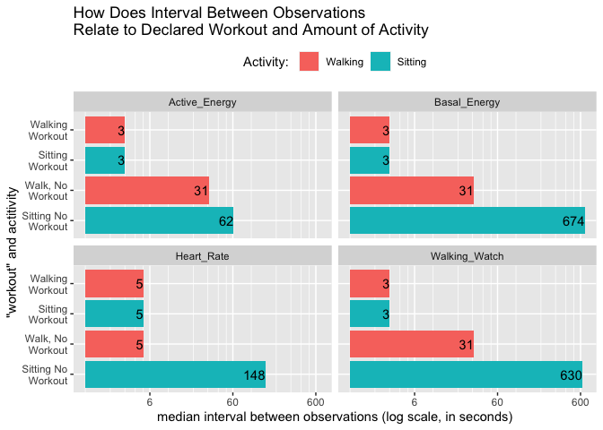

```
## ── Attaching packages ───────────────────────────────────────────────────── tidyverse 1.3.0 ──
```

```
## ✓ ggplot2 3.3.2     ✓ purrr   0.3.4
## ✓ tibble  3.0.4     ✓ dplyr   1.0.2
## ✓ tidyr   1.1.2     ✓ stringr 1.4.0
## ✓ readr   1.4.0     ✓ forcats 0.5.0
```

```
## ── Conflicts ──────────────────────────────────────────────────────── tidyverse_conflicts() ──
## x dplyr::filter() masks stats::filter()
## x dplyr::lag()    masks stats::lag()
```

```
## 
## Attaching package: 'lubridate'
```

```
## The following objects are masked from 'package:base':
## 
##     date, intersect, setdiff, union
```

```
## 
## Attaching package: 'janitor'
```

```
## The following objects are masked from 'package:stats':
## 
##     chisq.test, fisher.test
```

```
## 
## Attaching package: 'kableExtra'
```

```
## The following object is masked from 'package:dplyr':
## 
##     group_rows
```

## R Markdown

This post is Part II of a dive into the contents of the Apple Health Export.
[Part I](https://www.johngoldin.com/post/2020-02-15-apple-health-export1/) covered how to export the data from the Health app and import it into
R tables. It also described in detail how to adjust time stamps for daylight
savings and travel out of the local time zone.

Based on Part I, we have your data in the data frame `health_df`. 
The Health app emphasizes daily summaries of your data such as resting heart
rate, total steps, and the items the are covered by the "rings" that you see
in the Activity app. We will look at some summary in Part III, but in this
post the emphasisis will be on the intra-day details that are recorded in the Apple
Health Kit almost moment by moment. In the previous post I marvelled at how I had over
four million rows of data in `health_df`. What is all that stuff and what
is it good for.

I am going to restrict this post to the data that is generated by Watch OS
5.1.1.  Before OS 5 data was recorded much less frequently. When I first 
looked at the OS 5 data I noticed a few anomalies in the earliest versions.
Things seemed to settle down by 5.1.1 which in my case started in November 2018.
That's where I'll start with this analysis.


|type                               |         n| percent|
|:----------------------------------|---------:|-------:|
|ActiveEnergyBurned                 |   760,562|   0.411|
|HeartRate                          |   378,533|   0.205|
|BasalEnergyBurned                  |   305,629|   0.165|
|DistanceWalkingRunning             |   216,238|   0.117|
|AppleExerciseTime                  |    66,754|   0.036|
|StepCount                          |    51,398|   0.028|
|EnvironmentalAudioExposure         |    24,444|   0.013|
|AppleStandHour                     |    19,852|   0.011|
|FlightsClimbed                     |    12,935|   0.007|
|HeartRateVariabilitySDNN           |     6,535|   0.004|
|OxygenSaturation                   |     2,905|   0.002|
|SleepAnalysis                      |     1,166|   0.001|
|RestingHeartRate                   |       907|   0.000|
|WalkingHeartRateAverage            |       898|   0.000|
|DistanceCycling                    |       458|   0.000|
|MindfulSession                     |       145|   0.000|
|AppleStandTime                     |         0|   0.000|
|AudioExposureEvent                 |         0|   0.000|
|BloodPressureDiastolic             |         0|   0.000|
|BloodPressureSystolic              |         0|   0.000|
|BodyMass                           |         0|   0.000|
|DietaryCaffeine                    |         0|   0.000|
|DietaryCarbohydrates               |         0|   0.000|
|DietaryCholesterol                 |         0|   0.000|
|DietaryEnergyConsumed              |         0|   0.000|
|DietaryFatSaturated                |         0|   0.000|
|DietaryFatTotal                    |         0|   0.000|
|DietaryFiber                       |         0|   0.000|
|DietaryProtein                     |         0|   0.000|
|DietarySodium                      |         0|   0.000|
|DietarySugar                       |         0|   0.000|
|Dizziness                          |         0|   0.000|
|ECGOtherSymptom                    |         0|   0.000|
|HeadphoneAudioExposure             |         0|   0.000|
|Height                             |         0|   0.000|
|NumberOfTimesFallen                |         0|   0.000|
|oal                                |         0|   0.000|
|RapidPoundingOrFlutteringHeartbeat |         0|   0.000|
|SixMinuteWalkTestDistance          |         0|   0.000|
|StairAscentSpeed                   |         0|   0.000|
|StairDescentSpeed                  |         0|   0.000|
|VO2Max                             |         0|   0.000|
|WalkingAsymmetryPercentage         |         0|   0.000|
|WalkingDoubleSupportPercentage     |         0|   0.000|
|WalkingSpeed                       |         0|   0.000|
|WalkingStepLength                  |         0|   0.000|
|Total                              | 1,849,359|   1.000|

This table shows the counts of items that I regard as the intra-day watch items.
That works out to be about 1.5111267 rows per minute since November 2018. Wow!
That seems like a high density of
data. The top four account for about 97%. 

The point of this post will be to look in detail at these items.
Spoiler alert: I doubt that the thousands of intra-day rows for
basal or active energy are of much use, and we'll see why. Heart
rate over the course of the day has more potential and we'll 
see some examples later in this post.

### Workouts 

I have explored how frequently data rows are added, especially
basal energy, active energy, heart rate, and distance.
Workouts have a huge effect on frequency of measurements. I
did some crude experiments. Almost every day I walk the same 3.1
mile route in the woods. I compared a small sample of occasions doing
that route after declaring it to be a workout with a set of
occasions when I walked the same route but did not declare it as
a workout (and responded "dismiss" when my watch repeatedly
suggested it as a workout). I also tried sitting at my desk
while declaring that I was doing an indoor walking workout.

The effect is striking. Workouts produce many more measurements,
especially for active and basal energy, distance walked, and for heart rate.


```
## Loading required package: hms
```

```
## 
## Attaching package: 'hms'
```

```
## The following object is masked from 'package:lubridate':
## 
##     hms
```

```
## `summarise()` regrouping output by 'type2', 'workout', 'activity' (override with `.groups` argument)
```

```
## `summarise()` regrouping output by 'type2', 'workout' (override with `.groups` argument)
```
<!-- -->

In this plot, "workout" means that I have told my watch that
I am doing a workout. Regardless of my physical activity this
causes a large increase in how frequently data is recorded
on the watch (indicated by a shorter interval between
rows of data). If I am sitting working at my desk, (the bottom
bar), active energy is recorded about once a minute (67 seconds
on the "Siting No Workout" bar) and heart rate is recorded
about every three minutes. But if I have declared a workout,
active energy is recorded every 3 seconds and heart rate is
recorded every 5 or 6 seconds. If I'm actually walking,
the interval between measurements is shorter, although not
as short as when a workout is explicitly declared. 

Although it's not shown on the plot, the walk involved
about 6,600 steps while a little over an hour sitting
at my desk produced an average of about 400 steps
(sometimes I pace while I work).
While walking my heart rate was about 96,
but 66 when I was working at my desk.
The walk is a
moderately challenging hike with hilly terrain.
The increase in movement during the hike causes the
watch to record data more frequently, with sorter
intervals between measurements, although not as 
frequently as during a declared workout.

The effect of a declared workout on how frequently step count and
flights climbed is recorded is not as great so I have
not included those on the plot.


The large effect of a declared workout on frequency of observations
explains how I have racked up so many rows in
my watch data. My exercise of choice is hiking and my idea of
a good vacation is a walking holiday. Last summer I did two
eight or nine day walks in England averaging about 12 miles 
per day. And I did quite a few 6 to 12 mile training walks
as preparation. I declared workouts for all those walks and
generated a gigantic amount of data. (Note that my watch battery
held up fine doing all-day workouts.) Even my daily walk of a
bit over one hour generates a lot of data over the course of a year.

In fact, the table below shows that only about 38%
of all the observations in my dataset occur outside
the context of a workout.


```r
health_df %>% 
  dplyr::mutate(workoutActivityType = forcats::fct_lump(workoutActivityType),
                  workoutActivityType = forcats::fct_explicit_na(workoutActivityType, na_level = "Not a Workout")) %>% 
  janitor::tabyl(workoutActivityType) %>% 
  janitor::adorn_totals("row") %>% janitor::adorn_pct_formatting(digits = 0) %>% 
  knitr::kable(format = "markdown", align = c("lrr"),
               caption = "Workouts and Volume of Rows",
               format.args = list(big.mark = ",")) 
```


|workoutActivityType |         n| percent|
|:-------------------|---------:|-------:|
|Walking             |   641,949|     21%|
|Other               |    36,673|      1%|
|Not a Workout       | 2,309,757|     77%|
|Total               | 2,988,379|    100%|


Let's look at particular items.

Let's start with basal energy. This is a peculiar item. It's
not really a measurement. Basal energy is the amount of calories
the body consumes to maintain its internal operations even when
absolutely no physical activity involved. Most of what I know
about base matabolism comes from Wikipedia.
The Apple Watch has no way to measure basal metabolism directly.
Surely it relies on a common estimate based on age, gender,
height, and weight. This estimte doesn't change during
the day. I actually put my weight into the Health
app every day (via the Lose It! app) so there's a slight
change from day to day. Each day I get a day older. But I
haven't changed my height or my gender.

Given that basal energy doesn't really change, it's a bit
odd that there are over 800,000 rows of data. The Watch OS
seems to mostly aim to have a row for basal energy for
each row of active energy.

[note to self, where do the extra rows of active energy come from?]

If we zoom on a detailed subset of basal energy data, we
can see some patterns that should make us nervous about
how to interpret it. 

